# DBTC

**D**emand / **D**ifficulty BTC — a lending/accounting unit minted from Bitcoin network
difficulty. It uses difficulty as an independent, on-chain, fiat-agnostic signal for BTC
demand. Still very much research, model-first: the repo does the numerical homework and
every claim below is backed by a committed chart under `out/`.

## Contents

- [The idea](#the-idea)
- [Raw data (since 2009)](#raw-data-since-2009)
- [Does difficulty track relative price?](#does-difficulty-track-relative-price-analysis-mainpy)
- [The price models (`backtest.py`)](#the-price-models-backtestpy)
- [`lending.py` — live protocol numbers](#lendingpy--live-protocol-numbers)
- [The reference contract (Rootstock)](#the-reference-contract-rootstock)
- [What this is, and what it is not](#what-this-is-and-what-it-is-not)
- [Layout](#layout)

## The idea

Bitcoin's difficulty is set by the network itself (every 2016 blocks) purely from the
hashing power miners are spending. It is **not a price** measured in any currency and
needs no trusted oracle. The claim:

> **`D(t) / D(t0)` — smoothed network difficulty normalised to a reference point `t0` —
> is a proxy for *relative* BTC price, unit-free.**

A protocol loop (RBTC):

1. Deposit BTC/RBTC → mint **DBTC** worth `S(t0) = D_s(t) / D_s(t0)` (D_s = smoothed
   difficulty).
2. If smoother difficulty rises, return DBTC, take back RBTC, re-mint at the higher
   anchor → *long the difficulty of the BTC network*.
3. If smoothed difficulty falls sharply below mint level, the vault is liquidated.

Because difficulty is a pure protocol-internal measure, DBTC can be *accounted* in
USD via its 50WMA/200WMA analogue for reference, but the protocol value never depends on
an external feed.

## Raw data (since 2009)

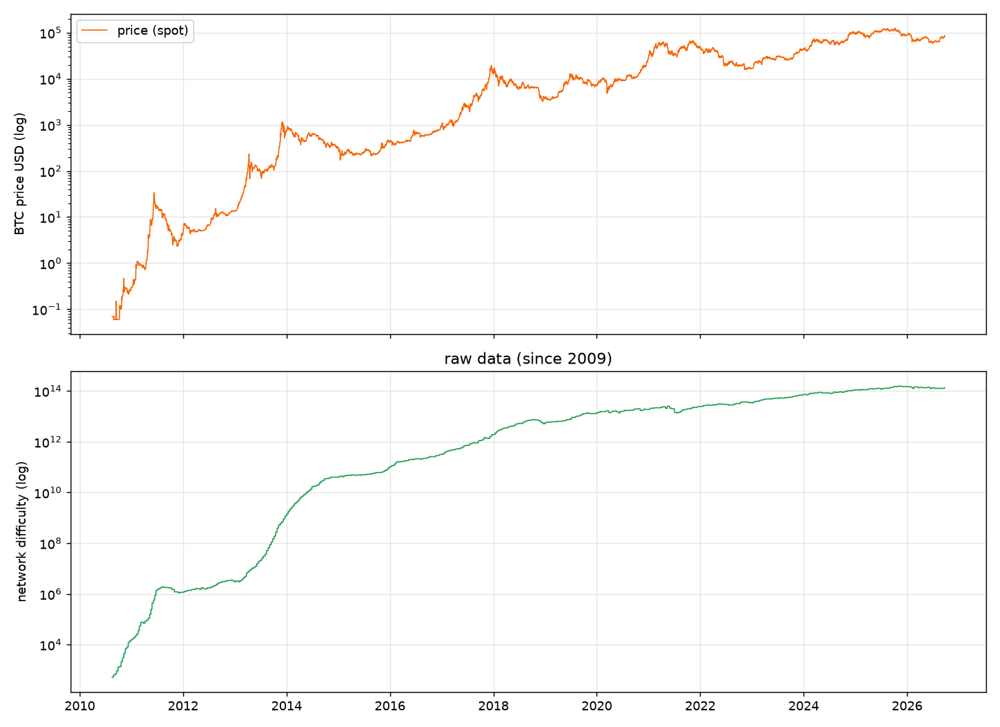

Both series span 2009→today (daily, blockchain.info). Price spans $0 → ~$65k, difficulty
spans 1 → ~110T: two power-law-ish curves. The two track each other well on a log scale —
that visual correlation is the entire thesis. → `main.py`, `dbtc/plot.py` `chart_raw`.

## Does difficulty track relative price? (analysis, `main.py`)

### Normalised log-ratios

The analysis picks a reference `t0`, computes `ln(price/price_t0)` and
`ln(diff_sm/diff_sm_t0)` for every day, and asks how well the two move together
(`02_ratios_log.png`, `03_regression.png`):

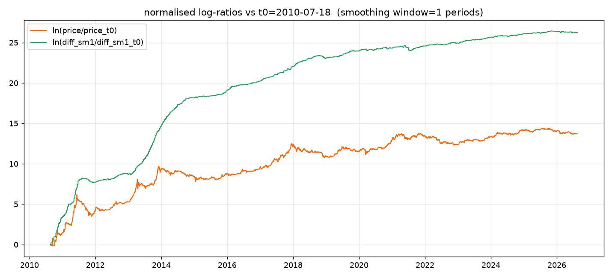

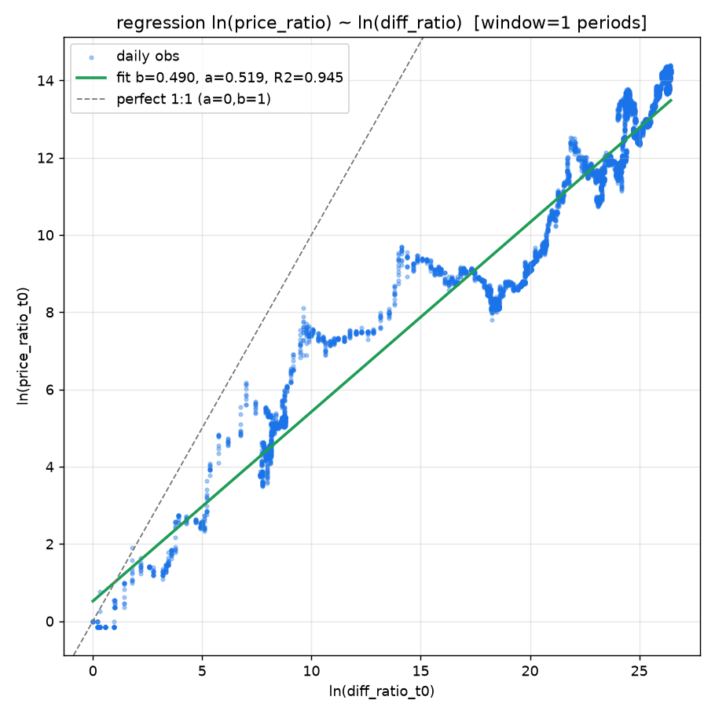

Fit (full-sample, best window):

Now smoothing windows are measured in **difficulty periods** (2016 blocks, ~2 weeks
each) instead of calendar days — the same unit the reference contract uses. 26 periods
≈ 1 year.

| smoothing | corr | R² | slope b | median \|err\| |
|-----------|------|-----|---------|----------------|
| 1p        | .972 | .945 | .49 | 54% |
| 4p        | .971 | .943 | .49 | 54% |
| 8p        | .970 | .941 | .48 | 54% |
| 13p       | .969 | .939 | .47 | 54% |
| 26p       | .968 | .936 | .47 | 56% |
| 52p       | .969 | .938 | .46 | 54% |

Readings:

- **correlation ≈ 0.97 regardless of window** — difficulty is a real proxy for *relative*
  price, even over daily data. Smoothing barely matters: the protocol already steps
  difficulty inherently every ~2 weeks.
- The fitted exponent `b ≈ 0.49` (`price ∝ difficulty^0.49`): doubling difficulty → ~1.4×
  price. Consistent across all windows (see `04_window_metrics.png`).
- **R² ≈ 0.94 but median |err| ≈ 54%** — the two are *correlated*, not tightly explained.
  At peaks difficulty overshoots (ebullient hashing) and at drawdowns it lags (capacity
  exit), so a *level* bet on difficulty carries ~±50% noise. `06_deviation.png` shows the
  largest deviations cluster at 2011/2013/2017/2021 peaks and 2015/2018/2022 drawdowns;
  `05_price_proxy.png` shows the reconstructed proxy price in log space:

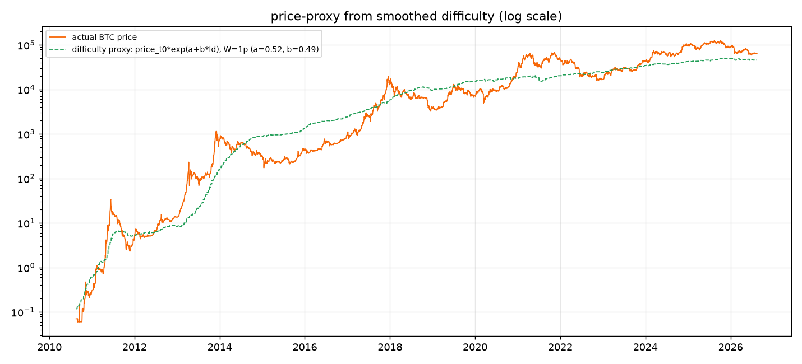

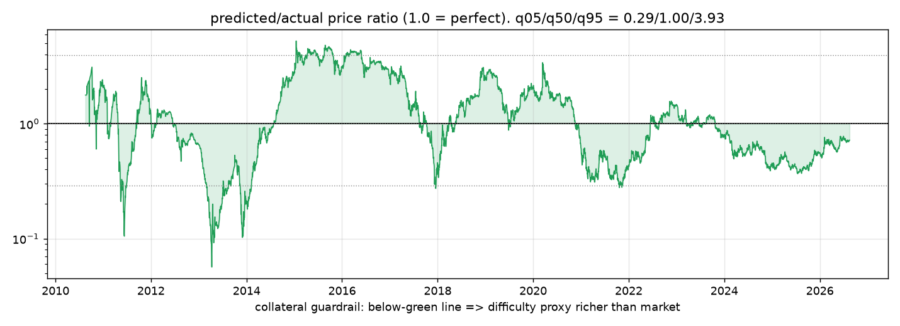

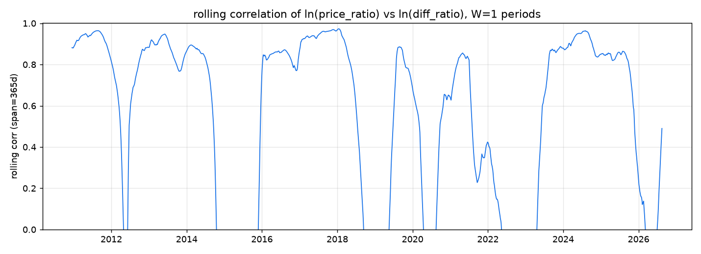

Fit-quality vs the smoothing window (`04_window_metrics.png`) is essentially a flat line:
once per-block stepping exists, extra smoothing buys nothing and loses nothing. That keeps
the protocol simple (raw difficulty, no WMA parameter to tune).

```bash
./.venv/bin/python main.py            # re-download if stale, fit, plot all of the above
```

## The price models (`backtest.py`)

`backtest.py` answers *"what if we launched N years ago?"*. Four candidate USD prices for
1 DBTC, all normalised to a common launch anchor (SMA-350):

- **DBTC** — pure difficulty-derived (the real design: `s0 = base · (D/D0)^b`)
- **wma (≈50w)** — SMA-350 of spot, the accounting anchor DBTC is meant to track
- **wma200 (≈200w)** — SMA-1400, the long-run reference line (chart only, not a scenario)
- **spot** — raw BTC/USD (conventional crypto payment baseline)

### Candidate values, and their volatility

`out/backtest/01_values.png` — top: the four price series (log). Bottom: rolling 90-day
annualised volatility of all four (log scale):

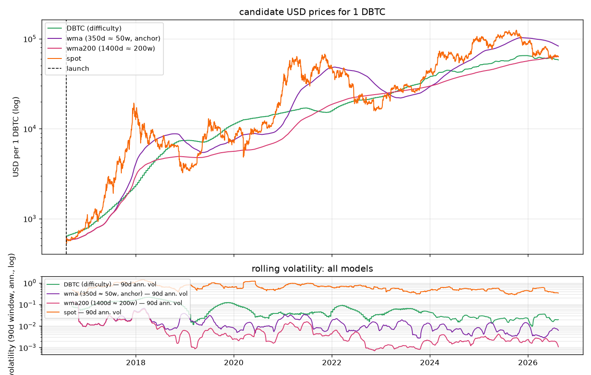

**The headline result:** DBTC is dramatically *smooth*. Rolling vol peaks in the
early 2012​–2015 era at ~10–20% for all series, but after ~2018 DBTC sits reliably
**under 5% (and often <2%)** while spot and even the 50w/200w SMAs swing 30–80%. DBTC's
daily jumps are pegged to the 2-week-per-2016-blocks difficulty cadence, not market micro,
so it is a genuine low-vol stable accounting unit — at the cost of trailing spot's returns.

Run and see: `./.venv/bin/python backtest.py --years 10` → regenerates `out/backtest/*.png`.

### Merchant: a USD-priced business accepting DBTC

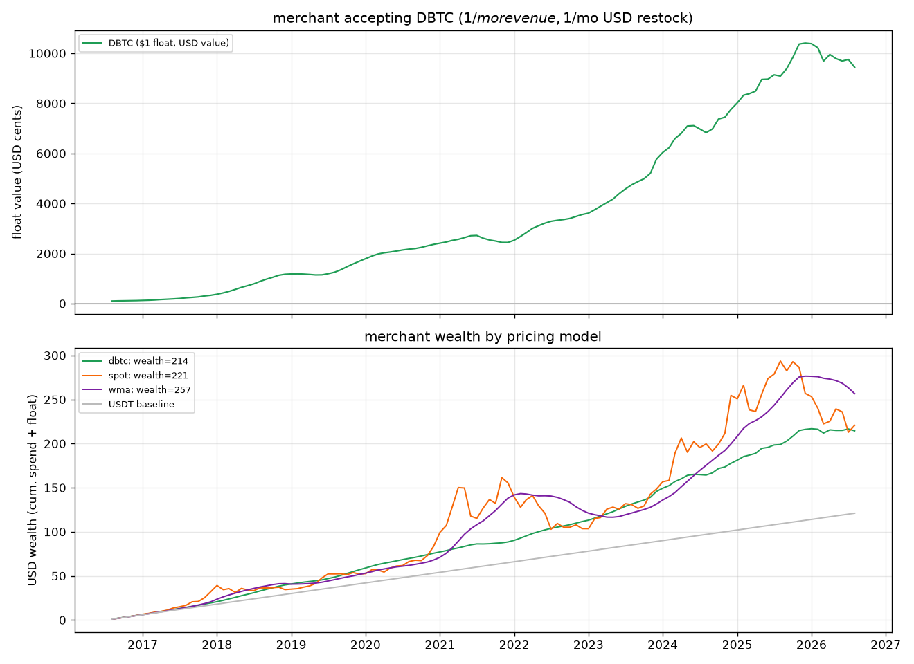

A business that passes revenue straight through (prices in USD, restocks in USD monthly)
has only its working-capital buffer exposed. Top panel: the $1 float's USD value. Bottom:
cumulative wealth vs USDT baseline.

Key figure: **DBTC** holds the float's max drawdown at only **−10.3%** vs **−75%** for
spot (the 50w SMA anchor sits between at −54%). A monthly-converted merchant is effectively
neutral-to-mildly-positive, because DBTC appreciates while barely ever drawing down
(`05_float_sensitivity.png` shows bigger floats magnify both win and risk).

### Salary: a worker paid fixed DBTC/month

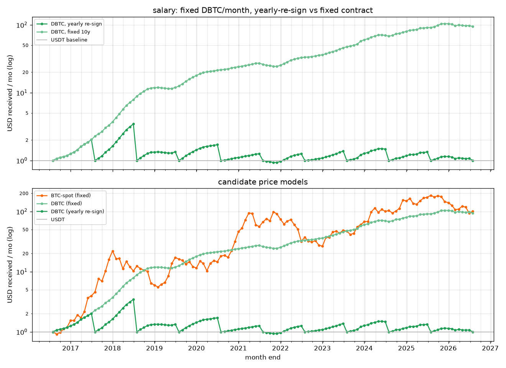

A yearly-re-signing salary lands at **~1.3x USDT** — DBTC behaves like a gently-upward,
low-vol USDT (income std ~0.4 $/mo). A fixed lead contract captures the underlying asset
appreciation, but inherits its full swings. `06_cumulative.png` collapses this to cumulative
multiple-vs-USDT across the four model×renewal combos.

### Collateral & liquidation (`lending.py`)

The vault's liquidation trigger is **pure difficulty**: you're liquidated when smoothed
difficulty falls to `(1/CR)^(1/b)` of its mint-time level (≈ −20% at CR=3). The worst case
differs strongly with the smoothing window (all `W` in difficulty periods, `since 2016`):

| smoothing W | worst month | worst 12-mo | months < launch | max price DD |
|-------------|-------------|--------------|-----------------|--------------|
| 13p | −10.4% | −4.7% | 0% | −20.2% |
| 20p | −5.9% | −1.3% | 0% | −15.5% |
| **26p** | **−5.3%** | **−0.6%** | **0%** | **−10.4%** |
| **39p** | **−4.1%** | **+1.6%** | **0%** | **−9.5%** |
| 52p | −3.6% | +3.1% | 0% | −8.4% |

Wider windows smooth out the 2021/2022 drawdown (worst smoothed-difficulty drawdown from
an ATH: −15.0% at 26p, ever shrinking as W grows). The real risk is the **spot/difficulty
spread**: at the worst point spot/DBTC fell to 0.28× while smoothed difficulty kept climbing.
That deviation — not difficulty itself — sets the collateral requirement:

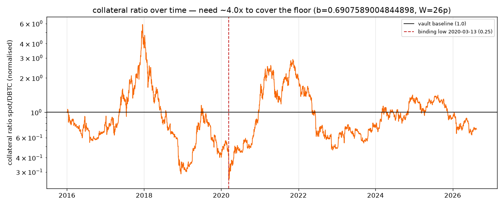

Across W it looks like (`07_w_sweep.png`, `08_merchant_window.png`): every W keeps the
worst-month drawdown above −5% at 26p+, and the never-liquidation backing is driven by how much
*smooth* `spot/DBTC` diverges. Anchored 2016 you need `≈4.0x` backing for "never" at 26p; the
switch is that "never" depends sensitively on the *anchor epoch*, because difficulty's
*level* can drift relative to spot (see table + charts at `07_w_sweep.png`, `08`).

Run: `./.venv/bin/python backtest.py --since 2016-01-01 --smooth 26` — prints all metrics.

## `lending.py` — live protocol numbers

Frozen defaults: `--since 2016-01-01`, `--smooth 26` (periods), `--law-b` auto-fitted
≈0.69, `--collat 3.0`. Once frozen, USD is never consulted at runtime; every number below
is difficulty arithmetic.

1. **Mint** — per 1 locked BTC, `mint = (D_ratio)^b / CR`. Today ≈ **68.5 DBTC/BTC**
   (`D_s ratio ≈ 2,229`, `b ≈ 0.691`, `CR=3`).
2. **Liquidation** — pure-difficulty floor at `(1/CR)^(1/b) ≈ 20.4%` of mint difficulty:
   the worst smoothed-difficulty drawdown (26p, `2021-11-15`) was −15.0%, so the floor
   held with ~5% to spare since 2016 — *but* the thin margin is why collateral matters. The
   `2020-03-13` spot crash was the worst *spot/DBTC* deviation (0.28 → min 0.252) → at CR=3
   only −16% margin; at CR=2.5 it's _negative_ — the thin spot deviation is the binding tail.
3. **USD value** — `SmoothUSD = P0 × D_ratio^b` with `P0` frozen once at the anchor
   (P0 ≈ $383, today ≈ $78.6k), purely difficulty-driven thereafter.
4. **Prices** — `out/lending_price.png` shows 30-day & 12-month DBTC/USD and the
   difficulty ratio vs its floor (`./.venv/bin/python lending.py`)

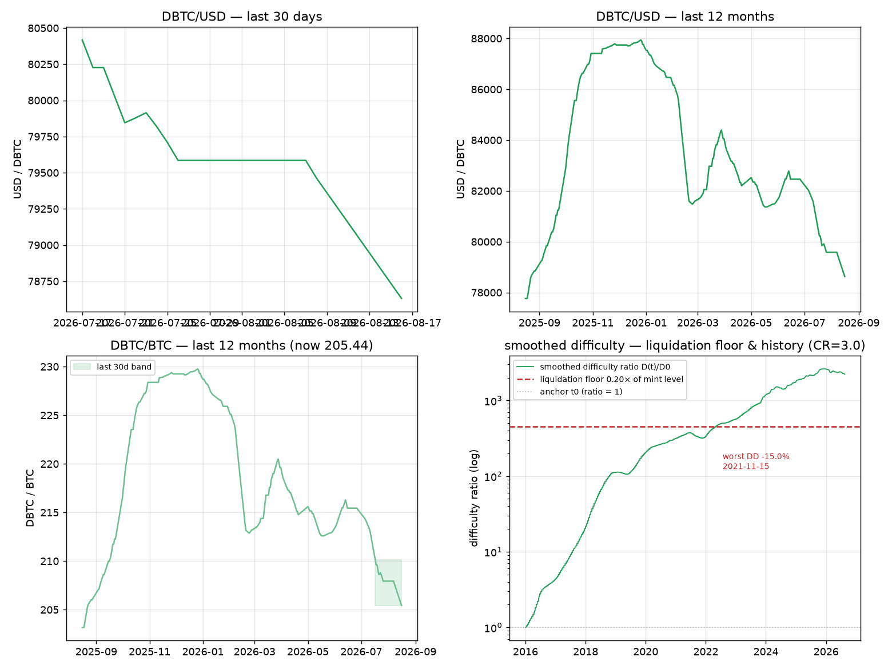

## The reference contract (Rootstock)

`contracts/DBTCPrice.sol` is a minimal, self-contained oracle that turns this whole
thesis into on-chain arithmetic **without any external price feed**. It reads Bitcoin
difficulty directly from the RSK Bridge (`getBtcBlockchainBestChainHeight` /
`getBtcBlockchainBlockHeaderByHeight`), parses each epoch's compact `nBits` target,
smooths it over difficulty periods, and prices DBTC with the fitted power law:

```
DBTC per BTC = (D_s / D_s0)^b        BTC per DBTC = 1 / (D_s / D_s0)^b     (CR = 1)
```

- **It smooths exactly like the Python model.** `D_s` is the mean difficulty over the
  trailing **`window` difficulty periods of 2016 blocks each** (default **26 ≈ 1 year**,
  the `lending.py` flagship) — equal weight per period, matching
  `analyze.smoothed_diff` in the Python code. Because difficulty only changes once per
  period, the window advances one period at a time; the two implementations agree by
  construction (same period series), so there is no calendar-vs-period skew.
- **No full header decode and no oracle**: since `target = MaxTarget / difficulty`, the
  ratio of two windows cancels `MaxTarget`; each period only contributes its 4-byte
  `nBits` field (header bytes 72–75), stored as `2^224 / target` in a small ring.
- **One read per difficulty period**: `refresh()` re-reads the bridge only when the best
  chain height crosses into a new 2016-block epoch; the ring and the cached ratio are
  updated once per period, not per block.
- **Fractional exponent on-chain**: `b ≈ 0.69` is not an integer, so the contract ships
  a signed 64.64 fixed-point library (`contracts/libraries/FixedPointMath.sol`) for
  `log2`/`exp2`/`pow`; `currentRatio` holds `(Σ window / Σ anchor)^b` and is recomputed
  once per period, so price reads are pure storage.
- **Getters** `dbtcPerBtc()` / `btcPerDbtc()` return 64.64 fixed point; `anchor()`
  freezes `D_s0` at mint time into `anchorSum`. The ring only needs the last `window`
  per-epoch `nBits` values to keep the window rolling; the newest epoch is pushed when
  it starts, and the oldest is dropped once the ring is full.

```bash
solc --bin --optimize contracts/DBTCPrice.sol   # compiles with solc 0.8.25
```

## What this is, and what it is not

- **DBTC is a stable-ish, difficulty-anchored accounting unit** — ~7× lower vol than
  spot since ~2016, difficulty-derived (no external price feed required to compute).
  At 26-period smoothing the worst historical smoothed-difficulty drawdown since 2016 is
  ~15% (2021 → 2022), so it is low-vol, not monotonic.
- It is **not** a get-wealthy instrument: over a bull decade margins clearly trail spot
  (`04_table.png`, `06_cumulative.png`). The pitch is *low-volatile stable pricing*, not
  alpha.
- **No fees/slippage/liquidation mechanics/S-M pool dynamics are modelled** — clean
  value-evenness math only.
- The difficulty law itself (price ∝ difficulty^b) has ±~55% median noise near peaks;
  liquidation triggers must tolerate that.

## Layout

```
main.py                  # download → analyse (difficulty vs price) → plot
backtest.py              # "what-if we launched N years ago" + merchant/collateral sweeps
lending.py               # live: mint / liquidation / USD value / 30d+12m prices
dbtc/analyze.py     # load data, smoothing windows, OLS fit, metrics
dbtc/backtest.py    # value models + cashflow simulators + merchant/collateral metrics
dbtc/plot.py        # analysis charts → out/*.png
dbtc/download.py     # blockchain.info fetcher, ~1-day cache
contracts/DBTCPrice.sol      # reference Rootstock oracle (diff → DBTC/BTC, see above)
contracts/libraries/FixedPointMath.sol  # 64.64 fixed-point pow for the ^b law
data/                    # cached blockchain.info JSON (auto-refreshed)
out/*.png                # committed charts referenced by this README
```